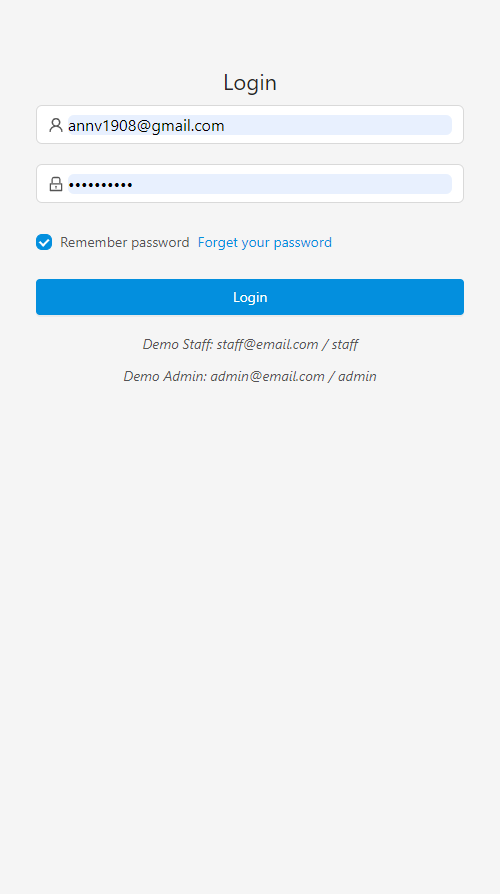
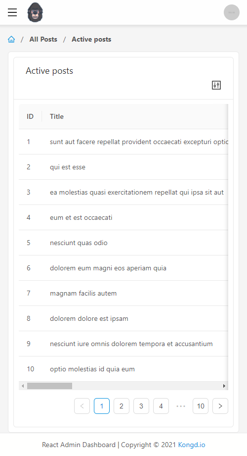
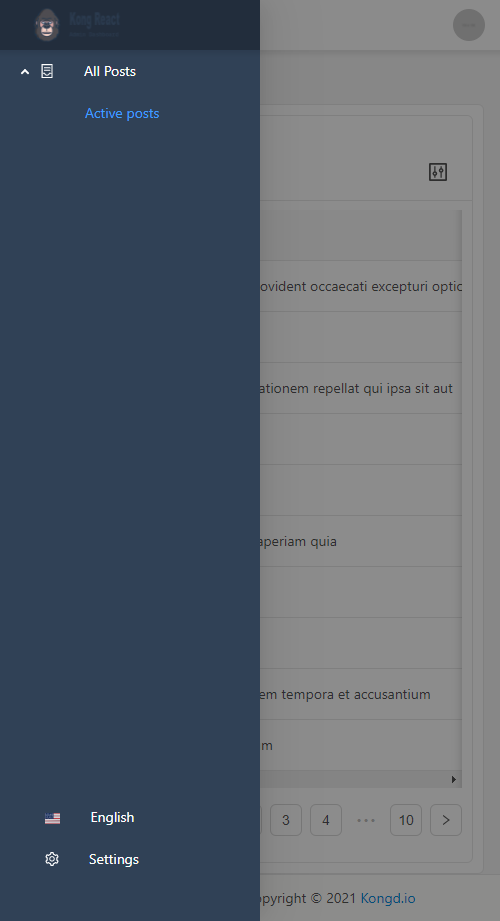
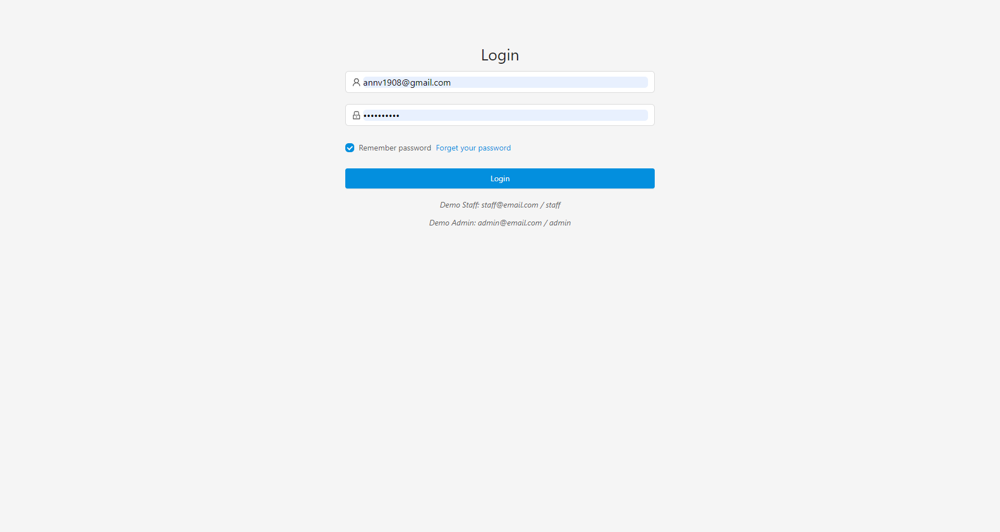
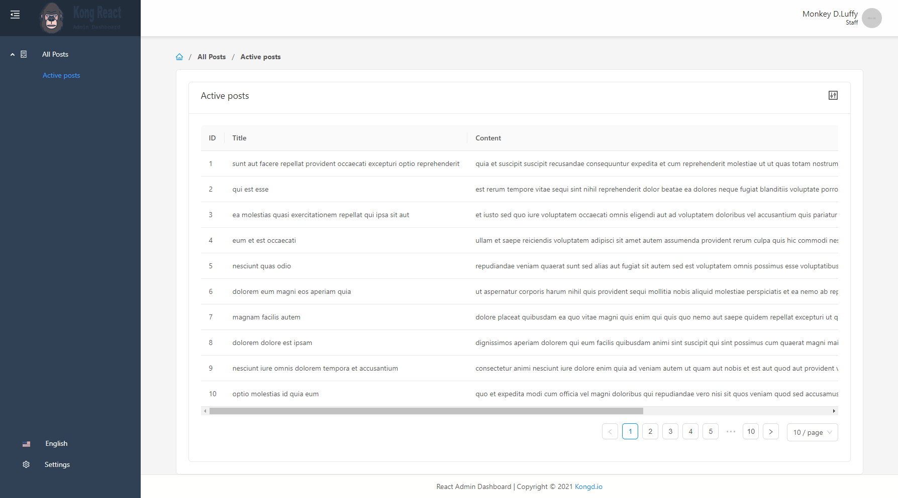
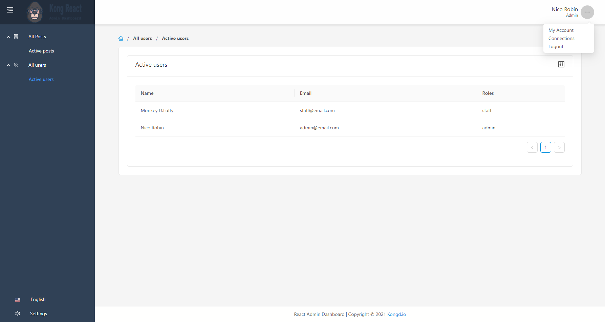
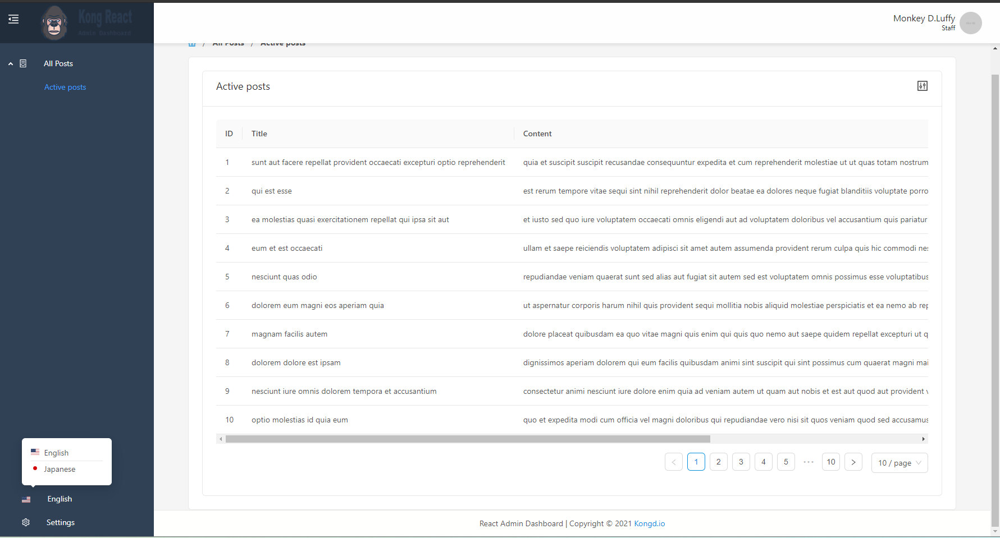
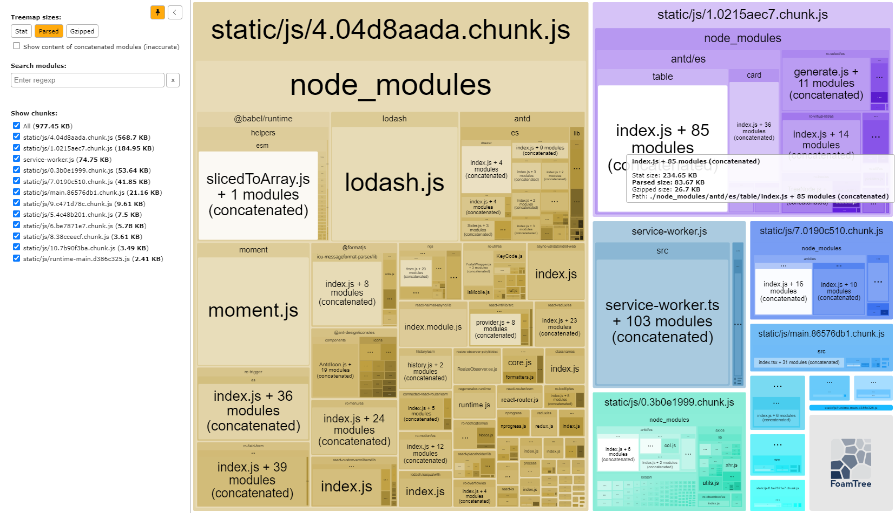

# Kong Next Admin Dashboard

_NextJs SSG admin template by Kongd team._

Key goals:

-   ReactJs + Typescript + NextJs
-   Ant design components + Ant design icons
-   Redux for React + Redux thunk
-   Axios
-   React hook + Rxjs for React hook
-   SASS style with `sass`

### Table of contents

-   [Quick start](#quick-start)
-   [Quick develop without Backend APIs](docs/mock-api.md)
-   [Customize configurations](#customize-configurations)
-   [Production bundle](#production-bundle)
-   [Multiple languages](docs/multiple-languages.md)
-   [Base stylesheet styles](docs/base-stylesheets.md)
-   [Screenshots](#screenshots)

## Quick start

-   Prerequisite:

    -   NodeJs 10 or above
    -   Yarn latest

-   Install depedencies

    ```bash
      yarn
    ```

-   Start dev server:

    -   Using mock json server:

        ```bash
            yarn dev
        ```

    -   Or without mock server:

        ```bash
            yarn start
        ```

## Customize configurations

-   Enviroment matching with your stage, refer [official documents](https://create-react-app.dev/docs/adding-custom-environment-variables/).

-   Quick implement Front-end with mock json server. Update to `mock/db.json`. See more details from [official documents](https://github.com/typicode/json-server#getting-started).

## Production bundle

-   Clean depedencies

    ```bash
      yarn
    ```

-   Update production environments at

    ```bash
      .env.production
    ```

-   Run linters to validate source code

    ```bash
      yarn lint
    ```

-   Run build with production mode

    ```bash
      yarn build
    ```

-   Production bundle resources at `build` directory.

## Screenshots
















